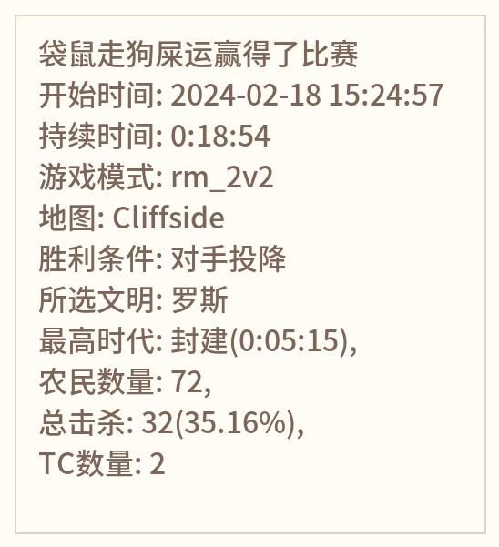

# AOE4战绩查询bot,hoshino插件

## 介绍
爬取AOE4WORLD的数据，实时通报战绩变化

这是一个hoshino机器人的插件，需要添加到hoshino本体里才能运行

搭建hoshino机器人请参考[Hoshino开源Project](https://github.com/Ice-Cirno/HoshinoBot)

## 安装指南
1. `pip install beautifulsoup4`
2. clone本插件： 在 `HoshinoBot\hoshino\modules` 目录下使用以下命令拉取本项目
3. 在 `HoshinoBot\hoshino\config\bot.py` 文件的 `MODULES_ON` 加入 `aoe4_watcher_bot,`
4. 然后重启 HoshinoBot，并在想要使用的QQ群里输入指令 `启用 aoe4_watcher_bot` 或者 `enable aoe4_watcher_bot`
5. 用steam短id查询steam的17位id: `转换id [steam短id]` 如： `转换id 222233344`
6. 添加玩家： `添加帝四玩家 [玩家昵称] [steam的17位id]`

如： `添加帝四玩家 袋鼠 76561198199800349`

如果平时有用aoe4world，也可以直接提供aoe4world的profile id，如： `添加帝四玩家 袋鼠 123456`

你也可以尝试直接添加用户名，如： `添加帝四玩家 袋鼠 Blake^` 但是可能会有重名的情况或者打错的可能，所以建议使用steam的17位id

然后就可以打一把快乐的帝四试试效果啦！
## 运行效果

## 后续计划
- [ ] 翻译各项数据